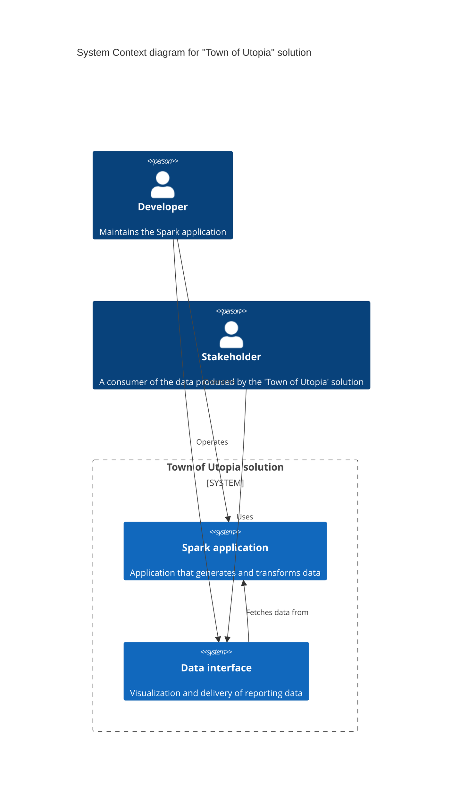

# sparkly-scala
Spark application to solve "Town of Utopia" data problems, including:
- Generating two datasets:
  - Video camera data with geolocation ID
  - Geolocation mapping (ID -> geolocation names) 
- Augmenting the video camera data with geolocation names
- Finding the most common item names detected by video cameras

Hard requirements:
- The Spark application must be written in Scala, with inputs and outputs parametrized and generalized
- All data transformations (excluding file I/O and logging) must be done using Resilient Distributed Datasets (RDDs)
- The video camera data should be augmented with minimal time/space complexity, and minimal shuffling of data

## Architecture overview
System context:


## Local environment setup (Windows)
Compatible versions:
- JDK 11
- Scala 2.13.15
- Spark 3.5.3
- Docker Engine 27.3.1
- Docker Desktop 4.36.0

Download and install the latest stable releases of the following:
- [Java Developer Kit 11 (JDK)](https://www.oracle.com/sg/java/technologies/javase/jdk11-archive-downloads.html)
  - _Note: Do not use a later version! Version 11 is used to bypass this permission error specific to creating a spark context on Windows: `java.lang.UnsupportedOperationException: getSubject is supported only if a security manager is allowed` (ref: [StackOverflow reference](https://stackoverflow.com/a/79017758))_
  - Set `JAVA_HOME` env var accordingly
  - Verify that `java -version` is as expected
- [Scala](https://www.scala-lang.org/download/)
  - Verify that `scala -version` is as expected
  - Use [sbt scalastyle](http://www.scalastyle.org/sbt.html) for checking scala style warnings
  - Use [scalafmt](https://scalameta.org/scalafmt/docs/installation.html) formatter for auto-linting
- [Apache Spark](https://spark.apache.org/downloads.html)
  - _For package type, choose "Pre-built for Apache Hadoop \<major\>.\<minor\> and later (Scala \<major\>.\<minor\>)"_
  - Set `SPARK_HOME` env var based on the parent dir of the `bin` directory
  - On Windows, to allow Hadoop compatibility, install [winutils](https://github.com/cdarlint/winutils)
  - Set `HADOOP_HOME` env var based on the bin directory containing `hadoop.dll` and `winutils.exe`
  - Verify that `spark-shell` runs without errors
- [IntelliJ Community Edition](https://www.jetbrains.com/idea/)
  - Set JDK path if prompted
  - Install Scala plugin if prompted
  - Install Scala SDK if prompted (Match the same version as the scala version installed)
- [Docker desktop](https://docs.docker.com/desktop/)
  - Verify that `docker version` is as expected
  - In IntelliJ, install Docker plugin if prompted
- (Optional) Spark applications in Scala are verbose by default. Set the logger level to your convenience
  - Example `log4j.properties` file set to warning level logs
    ```text
    # Set root logger level
    log4j.rootCategory=WARN, console
  
    # Console appender configuration
    log4j.appender.console=org.apache.log4j.ConsoleAppender
    log4j.appender.console.layout=org.apache.log4j.PatternLayout
    log4j.appender.console.layout.ConversionPattern=%d{yyyy-MM-dd HH:mm:ss} %-5p %c{1} - %m%n
  
    # Optional: Set specific loggers
    log4j.logger.org.apache.spark=WARN
    log4j.logger.org.apache.hadoop=WARN
    log4j.logger.yarn=WARN
    log4j.logger.io.netty=WARN
    ```
  - Specify the logging level as part of the spark-submit conf
    - eg. `spark-submit --conf "spark.driver.extraJavaOptions=-Dlog4j.configuration=file:/C:/spark/conf/log4j.properties" --conf "spark.executor.extraJavaOptions=-Dlog4j.configuration=file:/C:/spark/conf/log4j.properties" --class com.tou.App --master local[*] tou-app.jar`

## Running the scala application
### Local (Windows)
- Navigate to repo root directory, eg. `cd C:\Users\tommy\sparkly-scala`
- Compile
  - Using `scalac`: 
    ```bash
    scalac -cp "C:\spark\jars\*" src/main/scala/com/tou/global/*.scala src/main/scala/com/tou/producer/*.scala src/main/scala/com/tou/processor/*.scala -d utopia-app.jar -explain
    ```
  - _Note: Update `C:\spark\jars\*` to the corresponding location of your spark jars, or use an env var, eg. `$env:SPARK_HOME\jars\*` for Windows Powershell_
  - Verify that `tou-app.jar` was created
  - Using `sbt`:
    ```bash
      sbt clean assembly
    ```
   - Verify that `target/scala-2.13/tou-app-assembly-1.0.jar` was created
- Run: `spark-submit --class com.tou.App --master local[*] <path/to/jar> <topItemCount> <inputGeolocationFilePath> <inputVideoCameraItemsDetectedFilePath> <outputVideoCameraItemsDetectedByLocationFilePath> <outputTopItemsFilePath>`
  - Example: `spark-submit --class com.tou.App --master local[*] tou-app.jar 3 /opt/geolocation.parquet /opt/videoCameraItemsDetected.parquet /opt/videoCameraItemsDetectedByLocation.parquet /opt/topItems.parquet`
  - Example (with custom log4j settings): `spark-submit --conf "spark.driver.extraJavaOptions=-Dlog4j.configuration=file:/C:/spark/conf/log4j.properties" --conf "spark.executor.extraJavaOptions=-Dlog4j.configuration=file:/C:/spark/conf/log4j.properties" --class com.tou.App --master local[*] target/scala-2.13/tou-app-assembly-1.0.jar 3 artifacts/geolocation.parquet artifacts/videoCameraItemsDetected.parquet /opt/videoCameraItemsDetectedByLocation.parquet /opt/topItems.parquet`

### Containerized
- Run Docker Desktop
- Build: `docker build --progress=plain -t tou-app:latest .`
- Run: `docker run --rm tou-app:latest`

### Cloud (GCP)
- Option A ([ref](https://cloud.google.com/dataproc/docs/tutorials/spark-scala)):
  - Compile jar file
  - Upload jar file to GCS (Cloud storage)
  - Submit Spark job to Dataproc on GKE
- Option B ([ref](https://jaceklaskowski.github.io/spark-kubernetes-book/demo/deploying-spark-application-to-google-kubernetes-engine/#pushing-image-to-container-registry))
  - Build docker image
  - Upload image to container registry
  - Create GKE (Google Kubernetes Engine) cluster
  - Deploy to GKE
- _Note: CI/CD is not implemented_

### Unit tests
- Start the sbt server:
  ```bash
  sbt
  ```
  Expect some logs similar to:
  ```
  [info] welcome to sbt 1.10.6 (Oracle Corporation Java 11.0.24)
  [info] loading settings for project sparkly-scala-build from plugins.sbt...
  [info] loading project definition from C:\Users\tommy\sparkly-scala\project
  [info] loading settings for project sparkly-scala from build.sbt...
  [info] set current project to tou-app (in build file:/C:/Users/tommy/sparkly-scala/)
  [info] sbt server started at local:sbt-server-342fb03d9226c4625193
  [info] started sbt server
  ```
- In the sbt shell, run the unit tests
  ```bash
  test
  ```
  Expect some logs similar to:
  ```
  [info] DataProducerTest:
  [info] - importOrGenerateData should read from Parquet if file exists
  [info] - importOrGenerateData should generate= data if the file is missing
  [info] - importOrGenerateData should throw an exception for unsupported schema
  [info] Run completed in 10 seconds, 575 milliseconds.
  [info] Total number of tests run: 3
  [info] Suites: completed 1, aborted 0
  [info] Tests: succeeded 3, failed 0, canceled 0, ignored 0, pending 0
  [info] All tests passed.
  [success] Total time: 12 s, completed 18 Dec 2024, 10:37:27 PM
  ```
- Exit the sbt shell
  ```bash
  exit
  ```