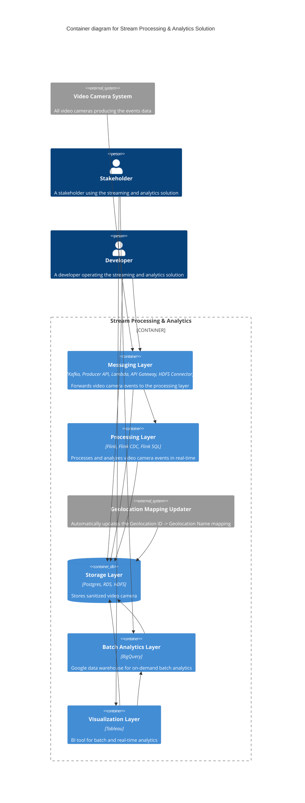

```mermaid
    C4Container
    title Container diagram for Stream Processing & Analytics Solution

    System_Ext(video_camera_system, "Video Camera System", "All video cameras producing the events data", $tags="v1.0")
    Person(stakeholder, Stakeholder, "A stakeholder using the streaming and analytics solution", $tags="v1.0")
    Person(developer, Developer, "A developer operating the streaming and analytics solution", $tags="v1.0")

    Container_Boundary(c1, "Stream Processing & Analytics") {
        Container(messaging_layer, "Messaging Layer", "Kafka, Producer API, Lambda, API Gateway, HDFS Connector", "Forwards video camera events to the processing layer")
        Container(processing_layer, "Processing Layer", "Flink, Flink CDC, Flink SQL", "Processes and analyzes video camera events in real-time")
        System_Ext(geolocation_updater, "Geolocation Mapping Updater", "Automatically updates the Geolocation ID -> Geolocation Name mapping")
        ContainerDb(storage_layer, "Storage Layer", "Postgres, RDS, HDFS", "Stores sanitized video camera")
        Container(batch_analytics_layer, "Batch Analytics Layer", "BigQuery", "Google data warehouse for on-demand batch analytics")
        Container(visualization_layer, "Visualization Layer", "Tableau", "BI tool for batch and real-time analytics")

        Rel(messaging_layer, processing_layer, "")
        Rel(processing_layer, storage_layer, "")
        Rel(batch_analytics_layer, storage_layer, "")
        Rel(visualization_layer, batch_analytics_layer, "")
        Rel(visualization_layer, storage_layer, "")
        Rel(messaging_layer, storage_layer, "")
        Rel(geolocation_updater, storage_layer, "")
    }

    Rel(stakeholder, visualization_layer, "")
    Rel(stakeholder, batch_analytics_layer, "")
    Rel(developer, storage_layer, "")
    Rel(developer, messaging_layer, "")
    Rel(video_camera_system, messaging_layer, "")


```